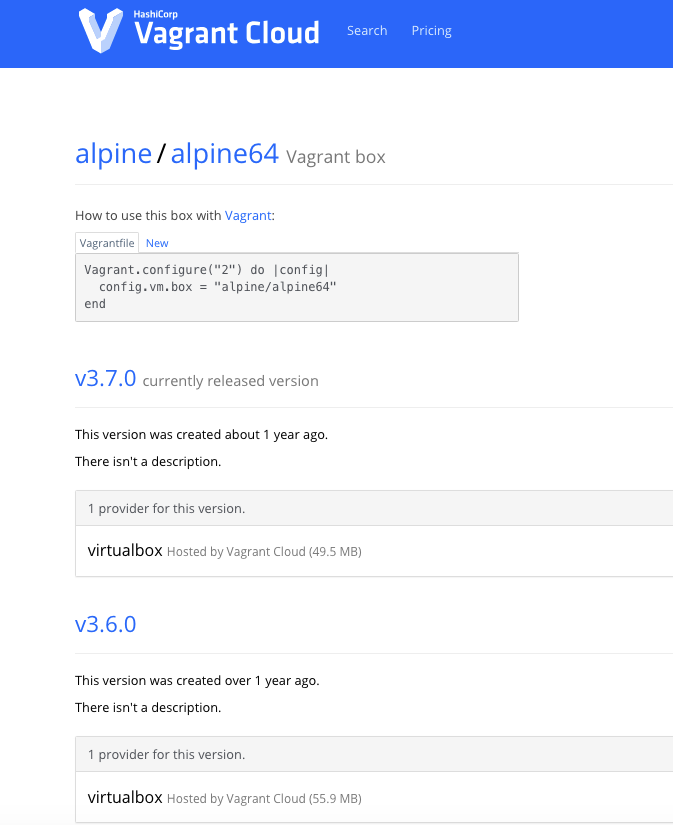
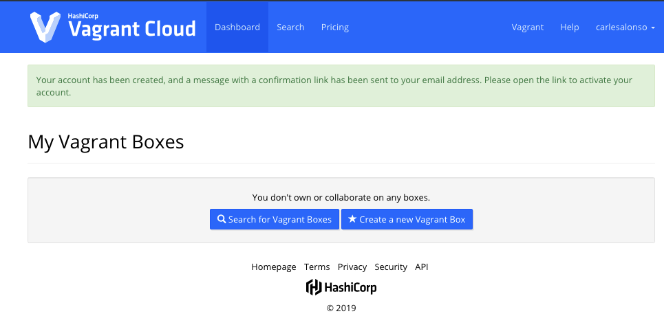
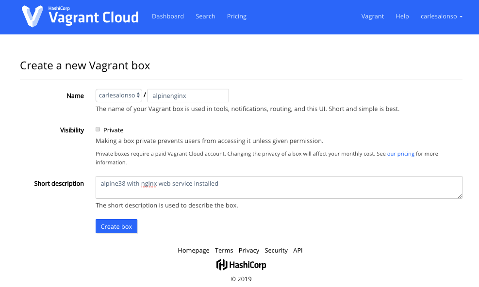
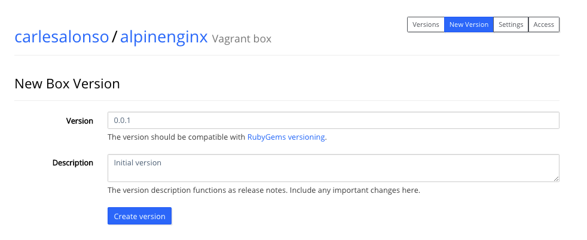
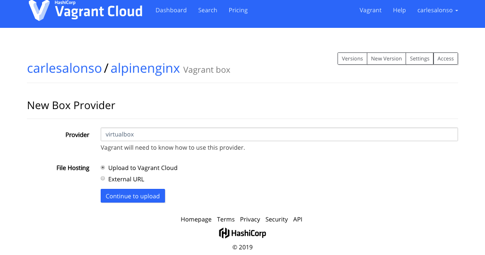
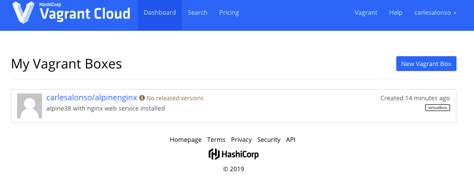

# Gestió dels boxes

Un box de Vagrant és un paquet específic que conté un entorn i que s'identifica amb l'extensió .box. Un box s'utilitza per crear les instàncies específiques i serà específic pel provider que es vulgui utilitzar. Això vol dir que un box creat per VirtualBox no es pot utilitzar amb hyperV o a l'inrevès. El box conté informació en diferents formats com ZIP, TAR, etc. Vagrant realment no utilitza aquesta informació, si no que l'envia al provider al moment d'invocar-lo.

La informació d'un box (metadades) es pot consultar mitjançanta la comanda *vagrant box list --box-info*, aquesta informació es la que es troba en un arxiu JSON anomenat *info.json*.

## Versionat de boxes

Els box de Vagrant tenen la característica que estan versionats, això vol dir, que podrem tenir diverses versions d'un mateix box convivint en el mateix ordinador. Això vol dir que quan fem un *vagrant up* i Vagrant comprova si hi ha actualitzacions, cas de trobar-ne, les descarrega en forma d'un box nou, sense modificar els que ja estan descarregats.

## Descàrrega d'un box Vagrant

Ja hem vist com descarregar un box de forma bàsica, indicant el seu nom de manera que es baixi del Cloud de Vagrant, això es pot fer, bé des dins de l'arxiu Vagrantfile, al moment de inicialitzar l'arxiu *vagrant init* o bé amb la comanda *vagrant box add* que vam veure al principi de treballar amb aquesta eina.

Si utilitzem aquest mètode, podem indicar bé el nom (shortcut), però també tenim l'opció d'indicar una ruta de descàrrega. Això serà molt útil quan calgui descarregar un box que no estigui disponible a la plataforma de Hashicorp. Per tant, podrem fer:

```bash
    vagrant box add debian/jessie64
```

o bé usant una URL, en aquest cas cal posar un nom al box per ser identificat en els passos posteriors:

```bash
    vagrant box add --name "elmeubox" http://example.com/boxaname.box
```

En el cas del boxes que es troben a Vagrant Cloud, podem veure les diferents versions existents d'un mateix box i podem triar quina es baixa, si no s'especifica es baixarà la més nova.



Per tant, si volem baixar la versió 3.6 enlloc de la més nova 3.7, farem servir la comanda però indicant la versió *vagrant box add alpine/alpine64 --box-version 3.6.0*.

## Instal·lar un box des d'un fitxer local

Si hem descarregat el box directament des del navegador o qualsevol altre sistema, per exemple, amb un pendrive, també podem podrem afegir el box al nostre sistema. Un cop hem posem a la carpeta on es troba l'arxiu .box que volem afegir farem la següent comanda *vagrant box add --name nom_del_box nomdelfitxerdelbox.box*. Per exemple:

```bash
    vagrant box add --name ubuntu/bionic64 ubuntu18.bionic64.box
```

Alternativament, es pot fer fent servir la següent comanda (suposant que l'arxiu es troba al disc D: i carpeta VagrantBoxes):

```bash
   vagrant box add ubuntu/bionic64 file:///D:/VagrantBoxes/ubuntu18.bionic64.box 
```

## Eliminar un box

Tot i que disposar de les diferents versions d'un box pot ser útil a l'hora de comprovar posibles incompatibilitats, al final, podem tenir el problema de de tenir el disc ple de versions obsoletes del box en qüestió, per tant, sovint és necessari eliminar versions antigues.

El primer que necessitarem serà saber si tenim versions obsoletes dels boxes, per fer això, la comanda serà *vagrant box prune --dry-run*

Si volem eliminar els boxes obsolets del nostre sistema escriurem *vagrant box prune*. També pot passar, que només volguem esborrar alguna versió en concret haurem d'especificar com abans la versió concreta *vagrant box remove alpine/alpine64 --box-version 3.6.0*.

I què passa quan volem eliminar un box, per tant, eliminant totes les versions que hi tinguem descarregades? Doncs que simplement farem *vagrant box remove alpine/alpine64* si a més hi afegim el paràmetre --force ho farà sense demanar confirmació.

## Vagrant Cloud

Hashicorp la companyia darrera de Vagrant ofereix un repositori de boxes anomenat Vagrant Cloud (antigament es deia Atlas). Per visitar-ho anirem al link <https://app.vagrantup.com.> D'aquí ens podrem baixar sense cap mena de limitació els boxes públics, però òbviament també permet la pujada, de manera que es pugui utilitzar com a repositori d'aquests arxius. Aquest servei disposa de tres nivells d'ús per adaptar-se a les diferents necessitas:

* **Free** permet la pujada il·limatada de boxes públics.
* **Personal** a més de disposar de boxes públics sense límit, podrem pujar boxes privats per $5 mes/box.
* **Organitzacions** incorpora la possiblitat de compartir els boxes privats entre equips i té un cost de 25$ mes/box.

Ara veurem com podem pujar un box al cloud. En primer lloc ens registrem, usarem un compte gratuït <https://app.vagrantup.com/account/new>


Un cop fet, rebrem un correu per confirmar el compte i ja estarem registrats (easy, easy)

Ara que ja estem registrats podem pujar els nostres boxes, tenint clar que amb el compte free seran públics i tothom els podrà descarregar.

En aquest cas, crearé una instància nova a partir de la d'alpine i instal·laré nginx:

```bash
    mkdir nginx
    cd nginx/
    vagrant init -m alpine/alpine64
```

A continuació ens connectarem i instal·larem nginx:

```bash
    vagrant up
    vagrant ssh
    alpine:~$ sudo apk update
    alpine:~$ sudo apk add nginx
    alpine:~$  sudo rc-update add nginx default
    alpine:~$ exit
    vagrant halt -f
```

Ara a Vagrant Cloud anirem a l'opció de crear un nou box



A continuació caldrà donar un nom al box, especificar la seva visibilitat i afegir una descripció, molt útil per si algú s'ho vol descarregar.



A continuació indicarem el versionat, **això és molt important** perquè permetrà que anem actualitzant el nostre box i que qui se l'hagi descarregat pugui mantenir el seu box descarregat sempre actualitzat.



Finalment, haurem d'indicar el provider que s'ha d'utilitzar, en el nostre cas VirtualBox


Ja només queda pujar el box, però primer haurem de crear el box a partir de la instància que tenim, per fer això, cal usar la comanda *vagrant package --output alpinengix.box*  (el paquet es crea a la mateixa carpeta del projecte) i pujar-lo al servidor.



Un cop fet podrem veure com apareix el nostre box



Existeixen serveis com [Artifactory](https://jfrog.com/artifactory/) que tot i que no són específics per gestionar boxes de Vagrant poden ser una alternativa a Vagrant Cloud.

[<< Tornar a índex AA3](../README.md)

[>> AA3. Carpetes Compartides](../T5)