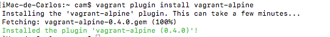
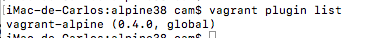

# Plugins

Vagrant disposa de tota una sèrie de plugins per augmentar les seves capacitats. En ser una eina oberta, tant empreses com desenvolupadors individuals poden desenvolupar extensions per tal que Vagrant incorpori les funcionalitats que necessitin.

Una de les característiques de les extensions de Vagrant és que es desevolupen en Ruby, el llenguatge en el que s'ha programat Vagrant. Els programes que contenen el codi, la documentació i les especificacions té l'extensió *.gem* i s'anomenen *gems* (gemes). Per tant una extensió de Vagrant serà un arxiu .gem.

Normalment, per gestionar un programa i les seves dependències s'usen eines, en el cas de Ruby, aquesta eina s'anomena *bundler*.

El primer que podem fer és veure la llista d'extensions o plugins que tenim instal·lat al nostre Vagrant:


## Instal·lació d'extensions

Bàsicament per instal·lar les extensions tindrem dos mètodes, bé utilitzar un arxiu local o bé instal·lar-los del repositori RubyGems.

Per instal·lar una extensió local, és tant senzill com indicar el nom de l'arxiu .gem (si no es troba a la carpeta on estem executant, cal indicar-lo):

```bash
    vagrant plugin install pluginfile.gem
```

La segona opció és instal·lar l'extensió directament de RubyGems el repositori més popular d'arxius .gem a Internet.

```bash
    vagrant plugin install nom-plugin
```

## Comandes bàsiques

Amb la comanda *vagrant plugin help* teniu una llista de les diferents opcions, però algunes de les més interessants:

* *vagrant plugin install*: instal·la una extensió.
* *vagrant plugin expunge*: elimina totes les extensions instal·lades.
* *vagrant plugin list*: mostra els plugins instal·lats.
* *vagrant plugin uninstall*: serveix per desinstal·lar una extensió.
* *vagrant plugin update*: permet actualitzar una extensió.

## Cercant extensions

Ja hem dit que podem instal·larles directament de RubyGems (<https://rubygems.org/)> però també podem trobar extensions a GitHub, Bitbucket,etc. En el cas de GitHub en el repositori oficial de Vagrant es manté una llista d'extensions amb els seus repositoris [link](https://github.com/hashicorp/vagrant/wiki/Available-Vagrant-Plugins).

## Exemple: Instal·lant una extensió

Com exemple, instal·larem una extensió que millora la gestió de les instàncies Alpine. Consultant a la llista d'extensions, veiem que es diu *vagrant-alpine*

```bash
    vagrant plugin install vagrant-alpine
```



Podem comprovar que s'ha instal·lat correctament amb la comanda *vagrant plugin list*:



Si ara obrim un projecte Alpine i el tanquem, podem comprovar que ara sí que es mapeja correctament la carpeta del projecte cap la carpeta */vagrant* de la màquina virtual. Així mateix, si fem *vagrant halt* la màquina es tanca correctament sense necessitat de forçar l'apagada.

[<< Tornar a índex AA3](../README.md)

[>> AA3. Exercicis resolts](../X)