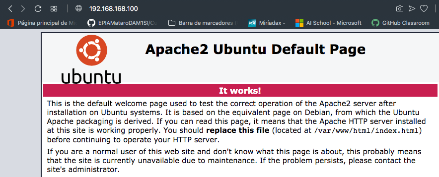

# Solucions

## Exercici 1

Primer de tot veiem com quedaria l'arxiu Vagrantfile:

```ruby
    Vagrant.configure("2") do |config|
        config.vm.box = "generic/ubuntu1804"
        config.vm.box_check_update = false
        config.vm.network "private_network", ip: "192.168.168.100"
        config.vm.synced_folder ".", "/vagrant"
    end
```

Un cop configurat, entrem amb ```vagrant ssh```i un cop dins instal·lem Apache2:

```bash
    sudo apt update
    sudo apt install apache2 -y
```

Un cop instal·lat, comprovem amb el navegador que ens podem connectar directament a la IP assignada.


